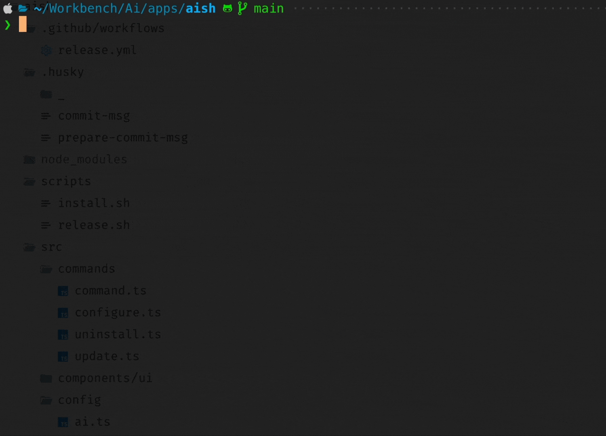

# aish

Your AI-powered command line assistant that supports multiple providers and models.



*Demo showing AISH in action. [Download MP4 version](assets/aish.mp4) for better quality.*

## 🚀 Installation

### Quick Install (Recommended)

```bash
curl -fsSL https://raw.githubusercontent.com/abhishekbhardwaj/aish-cli/main/scripts/install.sh | bash
```

This installs AISH to `~/.local/bin/aish` (following XDG Base Directory specification).

**After installation, configure your AI provider:**
```bash
aish configure  # Set up your AI provider and API key first
```

### Install Specific Version

```bash
VERSION=v1.2.3 curl -fsSL https://raw.githubusercontent.com/abhishekbhardwaj/aish-cli/main/scripts/install.sh | bash
# Then configure: aish configure
```

### Manual Installation

1. Download the appropriate binary for your platform from [releases](https://github.com/abhishekbhardwaj/aish-cli/releases)
2. Extract the archive: `tar -xzf aish-*.tar.gz` (or unzip for Windows)
3. Make executable: `chmod +x aish`
4. Move to PATH: `mv aish ~/.local/bin/` (or `/usr/local/bin/` with sudo)
5. **Configure your AI provider:** `aish configure`

### Build from Source

```bash
git clone https://github.com/abhishekbhardwaj/aish-cli.git
cd aish
bun install
bun run build
# Configure after building: ./aish configure
```

## 📖 Commands Reference

### 🤖 `ask` - Ask AI Questions

Ask the AI assistant any question and get intelligent responses.

> Coming Soon: enhancements so it'll automatically refer to local filesystem, shell history, clipboard, etc.

```bash
# Basic usage
aish ask "What is the capital of France?"
aish ask "Explain how Docker works"
aish ask "What's the difference between TCP and UDP?"

# Multi-word questions (quotes recommended)
aish ask "How do I optimize my React app performance?"

# Options
aish ask "Explain recursion" --completion          # Wait for complete response (no streaming)
aish ask "What is Python?" --provider openai       # Use specific provider
aish ask "Explain AI" --model gpt-4o               # Use specific model
```

**Options:**
- `--completion` - Wait for complete response instead of streaming
- `--provider <provider>` - Override default AI provider
- `--model <model>` - Override provider's preferred model

---

### 🛠️ `command` (alias: `c`) - AI-Powered Command Generation

Generate and execute shell commands using natural language descriptions.

```bash
# Basic usage
aish command "find all PDF files larger than 10MB"
aish c "compress all images in current directory"  # short alias
aish c "show me disk usage of each directory"

# Complex operations
aish command "backup my home directory to external drive"
aish c "find and delete all node_modules folders older than 30 days"
aish c "convert all PNG images to WEBP with 80% quality"

# Options
aish c "list running processes" --timeout 30       # Set timeout in seconds
aish c "show system info" --verbose                # Show detailed explanations
aish c "git status" --provider openai              # Use specific provider
aish c "docker ps" --model gpt-4o                  # Use specific model
```

**Options:**
- `-t, --timeout <seconds>` - Command timeout (no timeout by default)
- `--tty` - Force interactive/TTY mode for the command
- `-v, --verbose` - Show detailed explanations and context
- `--provider <provider>` - Override default AI provider
- `--model <model>` - Override provider's preferred model

**Interactive Flow:**
1. AI generates command(s) based on your description
2. Shows explanation of what the command does
3. Asks for confirmation before execution
4. Executes with real-time output

**Smart TTY Detection:** The AI automatically detects when commands need interactive terminal access (like `vim`, `nano`, `htop`) and enables TTY mode. Use `--tty` to force TTY mode for any command.

---

### ⚙️ `configure` - Setup AI Providers

Configure AI providers, models, and API keys with interactive or command-line interface.

```bash
# Interactive configuration (recommended for first-time setup)
aish configure

# Quick command-line setup
aish configure --provider anthropic --model claude-3-5-sonnet-20241022 --api-key sk-...
aish configure --provider openai --model gpt-4o --api-key sk-...
aish configure --provider groq --model llama-3.1-70b-versatile --api-key gsk_...
aish configure --provider ollama --model llama3.2 --base-url http://localhost:11434/api

# Management commands
aish configure --list                           # Show all configured providers
aish configure --set-default anthropic         # Set default provider
aish configure --update-model openai:gpt-4o    # Update model for existing provider
aish configure --remove openai                 # Remove a provider
```

**Command-Line Options:**
- `--provider <provider>` - AI provider (anthropic, openai, xai, openrouter, groq, mistral, google, ollama)
- `--model <model>` - Model name
- `--api-key <key>` - API key for cloud providers
- `--base-url <url>` - Base URL for local providers (e.g., Ollama)
- `--update-model <provider:model>` - Update model for existing provider
- `--set-default <provider>` - Set default provider
- `--remove <provider>` - Remove provider
- `--list` - Show all configured providers

**Interactive Features:**
- View current configuration
- Add new providers with guided setup
- Remove existing providers
- Set default provider
- Update models and API keys

---

### 🔍 `configuration` - View Current Setup

Display your current AI provider configuration.

```bash
aish configuration
```

**Output Example:**
```
Current Configuration:
✓ [DEFAULT] anthropic
    Preferred Model: claude-3-5-sonnet-20241022
    API Key: sk-****-key

  ollama
    Preferred Model: llama3.2
    Base URL: http://localhost:11434/api

  openai
    Preferred Model: gpt-4o
    API Key: sk-****-key
```

---

### 🔄 `init` - Interactive Setup

Alias for interactive configuration setup. Perfect for first-time users.

```bash
aish init
```

This is equivalent to `aish configure` and launches the interactive configuration menu.

---

### 🆙 `update` - Self-Update

Update AISH to the latest version or check for updates.

```bash
# Update to latest version
aish update

# Check for updates without installing
aish update --check
```

**Features:**
- Automatically detects current version
- Downloads and installs latest release
- Uses the same install script for consistency
- Shows version comparison before updating
- Safe update process with confirmation

**Example Output:**
```
🔍 Checking for updates...
Current version: 0.0.7
Latest version:  0.0.8
✅ Update available!

Updating from 0.0.7 to 0.0.8
🔄 Updating AISH...
✅ Update completed successfully!
```

---

### 🗑️ `uninstall` - Clean Removal

Completely remove AISH from your system with intelligent cleanup.

```bash
# Interactive uninstall (asks for confirmation)
aish uninstall

# Force uninstall (no confirmation)
aish uninstall --force

# Remove only configuration files (keep binary)
aish uninstall --config-only
```

**Smart Detection:**
- Automatically finds AISH binary in common locations:
  - `~/.local/bin/aish` (standard)
  - `~/.aish/bin/aish` (legacy)
  - `/usr/local/bin/aish` (system-wide)
  - `~/bin/aish` (user bin)

**Complete Cleanup:**
- Removes binary executable
- Removes configuration directory (`~/.config/aish`)
- Removes legacy config file (`~/.aish.json`)
- Provides manual cleanup instructions for PATH

**Options:**
- `--force` - Skip confirmation prompt
- `--config-only` - Only remove configuration files, keep binary

---

### 📋 Global Options

These options work with most commands:

```bash
# Get help for any command
aish --help
aish ask --help
aish command --help

# Check version
aish --version
aish -V
```

## 📁 Configuration Storage

Configuration is stored in `~/.config/aish/auth.json` with support for:
- Multiple providers with individual API keys and models
- Default provider selection
- Automatic migration from single-provider format

## 🤖 Supported Providers

| Provider | Models | Documentation |
|----------|--------|---------------|
| **Anthropic** | Claude 3.5 Sonnet, Claude 3 Opus, etc. | [Get API Key](https://console.anthropic.com/) |
| **OpenAI** | GPT-4o, GPT-4, GPT-3.5 Turbo, etc. | [Get API Key](https://platform.openai.com/api-keys) |
| **xAI** | Grok models | [Get API Key](https://console.x.ai/) |
| **OpenRouter** | 100+ models from various providers | [Get API Key](https://openrouter.ai/keys) |
| **Groq** | Llama, Mixtral, Gemma models (Fast & Free) | [Get API Key](https://console.groq.com/keys) |
| **Mistral** | Mistral 7B, Mixtral 8x7B, etc. | [Get API Key](https://console.mistral.ai/) |
| **Google** | Gemini Pro, Gemini Flash, etc. | [Get API Key](https://aistudio.google.com/app/apikey) |
| **Local Ollama** | Llama, Phi, Mistral, CodeLlama, etc. | [Install Ollama](https://ollama.com/download) |

## ⚡ Quick Provider Setup

### Cloud Providers (API Key Required)
```bash
# Anthropic Claude
aish configure --provider anthropic --model claude-3-5-sonnet-20241022 --api-key sk-ant-...

# OpenAI GPT
aish configure --provider openai --model gpt-4o --api-key sk-proj-...

# Groq (Fast & Free)
aish configure --provider groq --model llama-3.1-70b-versatile --api-key gsk_...
```

### Local Providers (Self-Hosted)
```bash
# Ollama (requires Ollama to be running locally)
# First: Install and start Ollama, then pull a model
ollama pull llama3.2
ollama serve  # if not running as service

# Configure AISH to use Ollama
aish configure --provider ollama --model llama3.2 --base-url http://localhost:11434/api

# Custom Ollama URL (remote server)
aish configure --provider ollama --model phi3 --base-url http://192.168.1.100:11434/api
```

## 🛡️ Security Best Practices

**API Key Management:**
- Store API keys securely (AISH stores them in `~/.config/aish/auth.json`)
- Use environment variables for CI/CD: `ANTHROPIC_API_KEY=xxx aish ask "..."`
- Regularly rotate API keys
- Use provider-specific key restrictions when available

**Command Execution Safety:**
- Always review generated commands before execution
- Use `--verbose` flag to understand what commands do
- Test destructive operations in safe environments first
- Keep backups before running system-level commands

## 🎨 Customization Tips

**Provider Selection:**
```bash
# Use different providers for different tasks
aish ask "creative writing prompt" --provider openai
aish c "system administration task" --provider anthropic
```

**Model Selection:**
```bash
# Use faster models for simple tasks
aish ask "what is 2+2" --model gpt-3.5-turbo

# Use powerful models for complex tasks
aish ask "design a microservices architecture" --model gpt-4o
```

## 🛠️ Development

This project was created using `bun init` in bun v1.2.18. [Bun](https://bun.sh) is a fast all-in-one JavaScript runtime.

### Setup

```bash
# Clone repository
git clone https://github.com/abhishekbhardwaj/aish-cli.git
cd aish
bun install

# Run in development mode
bun run dev ask "What is 2+2?"

# Build for current platform
bun run build
./aish --version
```

### Project Structure

```
src/
├── index.ts              # Main CLI entry point with all commands
├── commands/
│   ├── command.ts        # AI-powered command generation and execution
│   ├── configure.ts      # Interactive configuration management
│   ├── update.ts         # Self-update functionality
│   ├── uninstall.ts      # Clean system removal
├── config/
│   ├── ai.ts             # AI model integration and streaming
│   ├── config.ts         # Configuration management and storage
│   └── providers.ts      # AI provider definitions and models
├── components/
│   └── ui/
│       └── loading.ts    # Loading animations and spinners
└── scripts/
    ├── install.sh        # Cross-platform installation script
    └── release.sh        # Automated release management
```

## 🚀 Releasing New Versions

AISH uses semantic versioning and automated releases via GitHub Actions.

### Release Commands

```bash
# Patch release (1.0.0 -> 1.0.1)
# Use for: Bug fixes, minor updates, documentation changes
./scripts/release.sh patch

# Minor release (1.0.0 -> 1.1.0)
# Use for: New features, backwards-compatible changes
./scripts/release.sh minor

# Major release (1.0.0 -> 2.0.0)
# Use for: Breaking changes, major rewrites
./scripts/release.sh major
```

### Release Options

```bash
# Preview what will happen without making changes
./scripts/release.sh patch --dry-run

# Create release locally without pushing to GitHub
./scripts/release.sh patch --no-push
```

### What Happens During Release

1. **Version Bump**: Updates version in `package.json`
2. **Git Commit**: Commits the version change
3. **Git Tag**: Creates annotated tag (e.g., `v1.0.1`)
4. **Push**: Pushes commit and tag to GitHub
5. **GitHub Actions**: Automatically:
   - Builds binaries for all platforms (Linux, macOS, Windows)
   - Creates GitHub release with changelog
   - Uploads binaries with SHA256 checksums
   - Makes binaries available for download

### Version Guidelines

- **Patch (x.x.X)**: Bug fixes, typos, small improvements
  - Example: Fix crash when API key is missing
  - Example: Update documentation

- **Minor (x.X.x)**: New features, backwards compatible
  - Example: Add new AI provider support
  - Example: Add new command options

- **Major (X.x.x)**: Breaking changes
  - Example: Change configuration format
  - Example: Remove deprecated commands

### Manual Release (if needed)

```bash
# 1. Update version in package.json
# 2. Commit changes
git add package.json
git commit -m "chore: bump version to 1.0.1"

# 3. Create and push tag
git tag -a v1.0.1 -m "Release v1.0.1"
git push origin main
git push origin v1.0.1
```

## 🗺️ Roadmap

- [ ] **Agent**: Enable Aish to act autonomously, performing tasks or sequences of commands based on user instructions.

- [ ] **Workflows**: Allow users to create, manage, and execute a series of **agents**, written above. Sequences of CLI commands or tasks. This will also allow users to save and share workflows, making it easier to automate repetitive processes.

- [ ] **Research**: Allow Aish to perform research tasks, such as gathering information from the web, files from local filesystem, summarizing articles, or finding relevant documentation based on user queries. Once done, it'll generate a complete report.

- [ ] **Pilot**: A fully guided terminal experience to give you a complete copilot experience.

## 🔍 Troubleshooting

### Common Issues

**"No AI provider configured" Error:**
```bash
# Solution: Configure a provider first
aish configure --provider anthropic --model claude-3-5-sonnet-20241022 --api-key YOUR_KEY
```

**"Command not found: aish" Error:**
```bash
# Check if ~/.local/bin is in your PATH
echo $PATH | grep -o ~/.local/bin

# If not, add to your shell config (~/.zshrc, ~/.bashrc, etc.)
echo 'export PATH="$HOME/.local/bin:$PATH"' >> ~/.zshrc
source ~/.zshrc
```

**API Key Issues:**
```bash
# Check your configuration
aish configuration

# Update API key
aish configure --provider anthropic --api-key NEW_KEY

# Test with a simple question
aish ask "test" --provider anthropic
```

**Permission Denied Errors:**
```bash
# Make sure the binary is executable
chmod +x ~/.local/bin/aish

# Check file permissions
ls -la ~/.local/bin/aish
```

**Update Issues:**
```bash
# Manual update
curl -fsSL https://raw.githubusercontent.com/abhishekbhardwaj/aish-cli/main/scripts/install.sh | bash

# Check current version
aish --version

# Force reinstall
curl -fsSL https://raw.githubusercontent.com/abhishekbhardwaj/aish-cli/main/scripts/install.sh | bash -s -- --force
```

### Getting Help

- **Command Help**: `aish <command> --help`
- **General Help**: `aish --help`
- **Issues**: [GitHub Issues](https://github.com/abhishekbhardwaj/aish-cli/issues)
- **Discussions**: [GitHub Discussions](https://github.com/abhishekbhardwaj/aish-cli/discussions)

### Debug Mode

For development and troubleshooting:

```bash
# Build from source for latest features
git clone https://github.com/abhishekbhardwaj/aish-cli.git
cd aish
bun install
AISH_VERSION=dev bun run src/index.ts ask "test"
```
